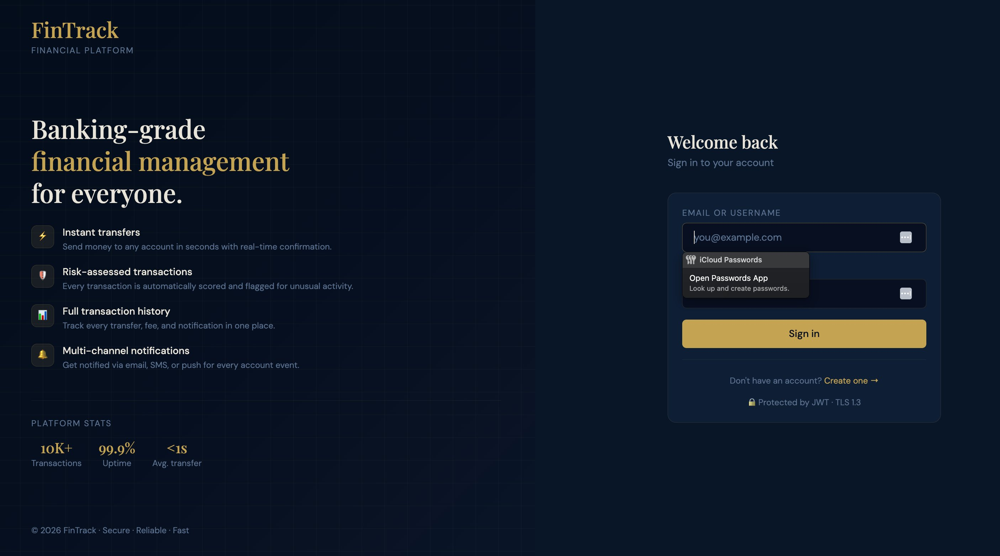
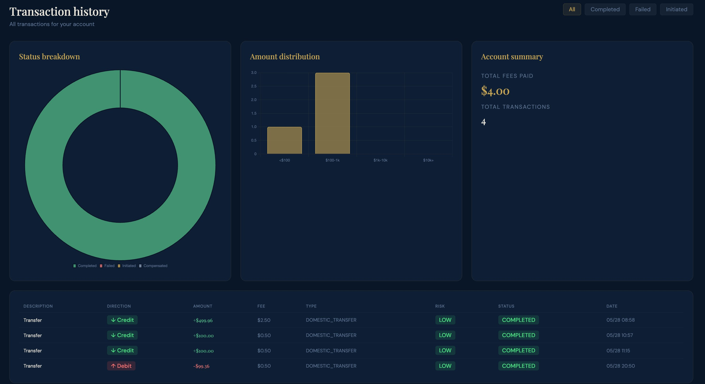

<p align="center">
  
  &nbsp;
  
</p>

# FinTrack — Production-Grade Fintech Microservices

A side-by-side **Java 17** and **Java 21** implementation of a financial-transactions
platform built with Spring Boot 3.x, Spring Cloud, Kafka/RabbitMQ choreography,
MySQL, Redis, EHCache (Hibernate L2), Resilience4j, ELK, Prometheus/Grafana, and
Zipkin tracing.

The Java 21 variant additionally demonstrates **virtual threads**, **records**,
**sealed interfaces**, **pattern matching**, and a **map-based strategy registry**
for O(1) strategy dispatch.

---

## Architecture

<p align="center">
  <a href="https://app.diagrams.net/#Uhttps://raw.githubusercontent.com/lbenzzine-ai/fintrack-microservices-platform/dev/docs/fintrack.drawio">📐 View Architecture Diagram</a>
</p>

---

## Repository Layout

```
fintrack/
├── java17/                       Spring Boot 3.2.x, JDK 17 (platform threads, Lombok @Data, interfaces)
│   ├── pom.xml                   Parent POM (fintrack-parent:1.0.0-jdk17)
│   ├── config-server/            :8888 — Spring Cloud Config Server
│   ├── eureka-server/            :8761 — Service Discovery
│   ├── api-gateway/              :8080 — Gateway, JWT, CB, Rate Limit, Swagger aggregator
│   ├── user-service/             :8081 — Users, JWT auth, Redis cache, Flyway
│   ├── account-service/          :8082 — Balances, EHCache L2, Saga participant
│   ├── transaction-service/      :8083 — Saga orchestrator, 100k seed, Strategy fees, Risk Engine
│   └── notification-service/     :8084 — Async multi-channel notifications
├── java21/                       Spring Boot 3.3.x, JDK 21 (virtual threads, records, sealed, pattern matching)
│   └── ... (identical service list, modernised internals)
├── postman/                      Postman collection + environments
├── scripts/                      bootstrap.sh, seed.sh, smoke.sh, build helpers
├── docs/                         Architecture notes, ADRs, sequence diagrams
├── docker-compose.yml            Full infra stack (MySQL ×4, Kafka, RabbitMQ, Redis, ELK, Zipkin, Prometheus, Grafana)
├── Makefile                      Top-level workflow shortcuts
└── README.md
```

## Service Topology

| Service               | Port | DB Port | Responsibilities                                                                         |
|-----------------------|------|---------|------------------------------------------------------------------------------------------|
| config-server         | 8888 | —       | Centralised config served from native FS / Git                                           |
| eureka-server         | 8761 | —       | Netflix Eureka service registry                                                          |
| api-gateway           | 8080 | —       | Reactive gateway, JWT filter, Redis rate limit, R4J CB, Swagger aggregator               |
| user-service          | 8081 | 3307    | Auth (JWT), users, roles. Emits `user-registered`                                        |
| account-service       | 8082 | 3308    | Balances, EHCache L2, interest Strategy. Debits sender + credits recipient atomically    |
| transaction-service   | 8083 | 3309    | Saga orchestrator. Fee Strategy, Risk Engine. Manages full transaction lifecycle         |
| notification-service  | 8084 | 3310    | Channel Strategy (Email/SMS/Push/Slack). Async. Consumes `notification-requested`        |

## Saga Choreography (Kafka topics)

### Registration flow

```
user-registered ──▶ account-service (auto-create wallet) ──▶ account-created
                                                                │
                                                       notification-service (welcome)
```

### Transaction flow

```
client ──▶ tx-service (initiate + risk-assess)
                │
                ├── risk BLOCKED ──▶ transaction-failed (alreadyDebited=false)
                │
                ▼
        transaction-initiated ──▶ account-service
                                        │
                                   [atomic DB tx]
                                   debit source account    (UUID-ordered lock)
                                   credit destination      (same transaction)
                                        │
                              ┌─────────┴──────────┐
                              ▼                    ▼
                       account-debited      account-credited
                              │
                              ▼
                       tx-service (DEBITED → risk re-assess → COMPLETED)
                              │
                    ┌─────────┴─────────────┐
                    ▼                       ▼
          transaction-completed       risk-assessed (review only)
                    │
          notification-requested ──▶ notification-service
```

### Failure & compensation flow

```
account-service (insufficient funds / frozen / unknown account)
        │
        ▼
transaction-failed (alreadyDebited=false) ──▶ tx-service marks FAILED
                                                        │
                                               no compensation needed
                                               (debit never occurred)

risk-engine (BLOCKED after debit — rare)
        │
        ▼
transaction-failed (alreadyDebited=true) ──▶ tx-service marks FAILED
                                                        │
                                                        ▼
                                           account-service.compensateCredit()
                                           (re-credits sender + fee)
                                                        │
                                                        ▼
                                              tx-service marks COMPENSATED
```

### Transaction status lifecycle

```
INITIATED ──▶ DEBITED ──▶ COMPLETED
                │
                └──▶ FAILED ──▶ COMPENSATED
```

> **Note:** `COMPENSATED` is a distinct terminal state from `FAILED`. It signals the
> debit was reversed — the account balance is restored and the saga is fully rolled back.

## Kafka Topic Reference

| Topic                          | Producer             | Consumer(s)                        | Purpose                                         |
|--------------------------------|----------------------|------------------------------------|-------------------------------------------------|
| `fintrack.user.registered`     | user-service         | account-service                    | Triggers wallet auto-creation                   |
| `fintrack.account.created`     | account-service      | notification-service               | Confirms wallet created; triggers welcome notify|
| `fintrack.tx.initiated`        | transaction-service  | account-service                    | Triggers atomic debit + credit                  |
| `fintrack.account.debited`     | account-service      | transaction-service                | Advances saga to DEBITED state                  |
| `fintrack.account.credited`    | account-service      | notification-service               | Notifies recipient of incoming funds            |
| `fintrack.tx.completed`        | transaction-service  | notification-service               | Saga success confirmation                       |
| `fintrack.tx.failed`           | transaction-service  | account-service, notification-service | Triggers compensation if `alreadyDebited=true` |
| `fintrack.notification.requested` | transaction-service | notification-service            | Decoupled notification dispatch                 |
| `fintrack.risk-assessed`       | transaction-service  | (audit / review systems)           | Emitted when risk score requires manual review  |

## Patterns Implemented

- **Strategy Pattern** — replaces every `switch` for fees, notifications, brokers, interest, compensation. Java 21 uses `sealed interface` + enum-keyed `Map<FeeType, FeeStrategy>` for O(1) dispatch.
- **Saga (Choreography)** — Kafka topics drive distributed transactions across services. No central coordinator; each service reacts to events.
- **Circuit Breaker** — Resilience4j with explicit CLOSED/OPEN/HALF-OPEN states on the API Gateway.
- **Risk Engine** — pluggable rule-based `RiskEngine` assesses every transaction at creation and again before completion. Scores: LOW / MEDIUM / HIGH / BLOCKED. Blocked transactions are rejected pre-debit or compensated post-debit.
- **Atomic debit + credit** — `AccountService.debit()` locks both accounts in UUID order within a single `@Transactional` boundary, eliminating A→B / B→A deadlocks under concurrent transfers.
- **Caching** — Hibernate L1 (session), L2 (EHCache READ_WRITE / READ_ONLY), Query Cache, Redis `@Cacheable`. All cache entries are evicted on every balance-mutating operation.
- **Messaging Abstraction** — `MessagingStrategy` swaps between Kafka and RabbitMQ via `fintrack.messaging.broker` config property. Zero code changes to swap brokers.
- **MapStruct** mappers everywhere (Entity ⇄ DTO).
- **Flyway** migrations per service DB.
- **OpenAPI 3** with JWT auth, aggregated at the gateway.
- **Weekend fee surcharge** — `FeeCalculationContext` includes an `isWeekend` flag; fee strategies can apply a surcharge on Saturday/Sunday transactions.

## Quick Start

```bash
make infra-up         # docker-compose: MySQL ×4, Kafka, RabbitMQ, Redis, Zipkin, Prom/Graf, ELK
make build-17         # build the Java 17 stack
make run-17           # run all services (Java 17)
make seed             # populate transaction-service with 100k+ rows
make smoke            # run smoke tests
make stop             # stop everything

make build-21 / make run-21   # Java 21 equivalents
```

## UI Reference

Every web UI / health endpoint exposed by the stack once `make infra-up` and `make run-17` (or `run-21`) are up.

### Application services (Spring Boot)

| Service              | URL                                       | Port | Credentials                                           | Description                                                                 |
|----------------------|-------------------------------------------|------|-------------------------------------------------------|-----------------------------------------------------------------------------|
| API Gateway          | http://localhost:8080                     | 8080 | JWT (per user)                                        | Reactive Spring Cloud Gateway. Front door for all `/api/**` traffic.        |
| Swagger UI           | http://localhost:8080/swagger-ui.html     | 8080 | none                                                  | Aggregated OpenAPI 3 spec across every downstream service.                  |
| Eureka Dashboard     | http://localhost:8761                     | 8761 | `${EUREKA_USER}` / `${EUREKA_PASSWORD}`               | Netflix Eureka registry — see every registered instance and its status.     |
| Config Server health | http://localhost:8888/actuator/health     | 8888 | `${CONFIG_SERVER_USER}` / `${CONFIG_SERVER_PASSWORD}` | Spring Cloud Config Server health + served-repo info.                       |
| User Service         | http://localhost:8081/actuator/health     | 8081 | none                                                  | Users / auth bounded context. JWT issuer.                                   |
| Account Service      | http://localhost:8082/actuator/health     | 8082 | none                                                  | Balances, EHCache L2, atomic debit/credit, saga participant.                |
| Transaction Service  | http://localhost:8083/actuator/health     | 8083 | none                                                  | Saga orchestrator with fee Strategy and Risk Engine.                        |
| Notification Service | http://localhost:8084/actuator/health     | 8084 | none                                                  | Async channel-Strategy (Email/SMS/Push/Slack).                              |

### Messaging & data infrastructure

| Tool         | URL                          | Port  | Credentials                                 | Description                                                              |
|--------------|------------------------------|-------|---------------------------------------------|--------------------------------------------------------------------------|
| Kafdrop      | http://localhost:8090        | 8090  | none                                        | Kafka cluster UI — browse topics, partitions, consumer groups, messages. |
| RabbitMQ     | http://localhost:15672       | 15672 | `${RABBITMQ_USER}` / `${RABBITMQ_PASSWORD}` | Management console for AMQP queues, exchanges, bindings.                 |
| MailHog      | http://localhost:8025        | 8025  | none                                        | Fake SMTP inbox (SMTP on :1025) — every notification email lands here.   |
| MySQL users  | jdbc://localhost:3307        | 3307  | `${MYSQL_USER}` / `${MYSQL_PASSWORD}`       | `fintrack_users` schema for user-service.                                |
| MySQL acct.  | jdbc://localhost:3308        | 3308  | `${MYSQL_USER}` / `${MYSQL_PASSWORD}`       | `fintrack_accounts` schema for account-service.                          |
| MySQL tx     | jdbc://localhost:3309        | 3309  | `${MYSQL_USER}` / `${MYSQL_PASSWORD}`       | `fintrack_transactions` schema for transaction-service.                  |
| MySQL notif. | jdbc://localhost:3310        | 3310  | `${MYSQL_USER}` / `${MYSQL_PASSWORD}`       | `fintrack_notifications` schema for notification-service.                |
| Redis        | redis://localhost:6379       | 6379  | none                                        | Cache for user-service `@Cacheable` and gateway rate-limit.              |

### Observability stack

| Tool          | URL                                       | Port | Credentials                               | Description                                                          |
|---------------|-------------------------------------------|------|-------------------------------------------|----------------------------------------------------------------------|
| Zipkin        | http://localhost:9411                     | 9411 | none                                      | Distributed-trace UI for B3-propagated requests across all services. |
| Prometheus    | http://localhost:9090                     | 9090 | none                                      | Metrics scrape & PromQL UI. Targets every Micrometer endpoint.       |
| Grafana       | http://localhost:3000                     | 3000 | `${GRAFANA_USER}` / `${GRAFANA_PASSWORD}` | Dashboards (latency, R4J circuit-breaker, JVM, Kafka lag).           |
| Elasticsearch | http://localhost:9200/_cluster/health     | 9200 | none                                      | ELK storage — log index lives here.                                  |
| Logstash      | tcp://localhost:5044                      | 5044 | none                                      | Beats/JSON log ingestion endpoint.                                   |
| Kibana        | http://localhost:5601                     | 5601 | none                                      | Log search/visualisation UI for the `fintrack-*` indices.            |

## Java 17 vs Java 21 — Where the Versions Diverge

| Concern              | Java 17                                      | Java 21                                          |
|----------------------|----------------------------------------------|--------------------------------------------------|
| DTOs                 | `@Data @Builder` Lombok classes              | `record` types                                   |
| Strategy hierarchy   | `interface FeeStrategy`                      | `sealed interface FeeStrategy permits ...`       |
| Strategy registry    | `Map<String, FeeStrategy>` (Spring-injected) | `Map<FeeType, FeeStrategy>` enum-keyed, O(1)     |
| Type checks          | `instanceof X` + explicit cast               | `instanceof X x` pattern binding                 |
| Branching            | `if/else if`                                 | switch expressions                               |
| Threading            | Tomcat platform pool (200)                   | `spring.threads.virtual.enabled=true`            |
| Spring Boot          | 3.2.5                                        | 3.3.5                                            |

See `docs/JAVA21-DIVERGENCE.md` for line-by-line examples.
